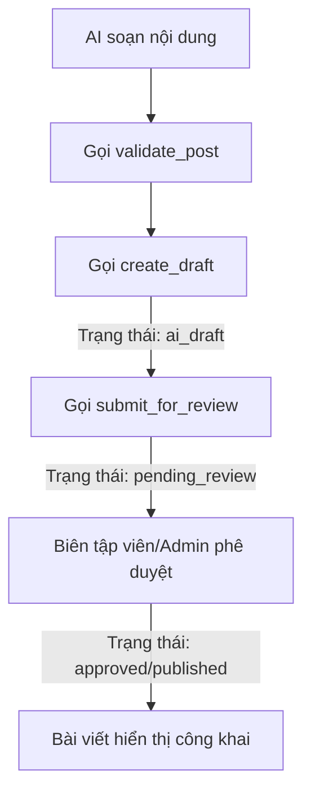

# Kỹ năng Bảo mật, Tích hợp API & Quy trình Duyệt bài (Bright Education)

Kỹ năng này hướng dẫn trợ lý AI cách kết nối bảo mật với cổng quản trị Bright Education, xử lý tránh xung đột dữ liệu, làm sạch nội dung chống tấn công XSS và tuân thủ quy trình kiểm duyệt bài viết phân tầng.

## 1. Xác thực & Ràng buộc bảo mật API

Mọi kết nối từ các môi trường bên ngoài (Cursor IDE, VS Code, n8n, Python script...) bắt buộc tuân thủ:

- **Địa chỉ gọi API (Endpoint):** `https://brighteducation.net/api/agent`
- **Xác thực:** Gửi Bearer Token trong header `Authorization: Bearer <TOKEN>`. Nghiêm cấm truyền token qua query string.
- **IP Allowlist:** Kết nối từ các IP ngoài danh sách cho phép trên Admin Panel sẽ trả về lỗi `403 Forbidden`.
- **Rate Limiting:** Tối đa 60 requests/phút cho mỗi Token. Vượt quá sẽ nhận lỗi `429 Too Many Requests`.

---

## 2. Kiểm soát xung đột & Chống ghi đè dữ liệu

Khi thực hiện các thao tác ghi (`POST`), AI Agent phải áp dụng 2 cơ chế:

### A. Chống gửi trùng (Idempotency Key)
- Để tránh tạo bài viết trùng lặp do timeout đường truyền, AI Agent cần đính kèm header `Idempotency-Key` chứa mã định danh duy nhất (UUID hoặc Hash) trong mọi request `POST` tạo/sửa bài viết.
- Máy chủ sẽ tự động lưu vết và trả về phản hồi giống hệt lần gọi đầu tiên nếu phát hiện trùng khóa Idempotency.

### B. Chống ghi đè chéo (Optimistic Locking)
- Khi gọi `action=update_post`, AI Agent phải gửi kèm tham số `expected_updated_at` (ngày cập nhật cuối của bài viết lúc AI bắt đầu đọc dữ liệu).
- Nếu Biên tập viên khác đã sửa bài viết trên server trong thời gian AI đang soạn thảo, ngày cập nhật sẽ thay đổi. API sẽ chặn hành động ghi đè và trả về lỗi `409 Conflict`. AI cần báo cho người dùng hoặc tải lại dữ liệu mới để so sánh diff.

---

## 3. HTML Sanitization & Kiểm duyệt XSS

Mọi nội dung soạn thảo HTML gửi lên server qua `action=create_draft` hoặc `update_post` sẽ tự động đi qua bộ lọc làm sạch:
- Loại bỏ hoàn toàn mọi cặp thẻ `<script>` để ngăn ngừa Stored XSS.
- Loại bỏ các inline event listeners như `onclick`, `onload`, `onerror`.
- Thay đổi các liên kết `href="javascript:..."` sang `href="#"`.

> [!WARNING]
> Nếu AI cố tình gửi mã script độc hại, hành động kiểm duyệt có thể đánh lỗi bài viết và từ chối lưu trữ.

---

## 4. Quy trình Duyệt bài viết phân tầng

AI Agent không có quyền xuất bản trực tiếp bài viết lên website trừ khi Token được cấp scope đặc biệt `posts:publish`. Quy trình tiêu chuẩn gồm:

1. **AI Soạn nội dung & Chạy đánh giá:**
   AI gọi `POST ?action=validate_post` để lấy báo cáo về chất lượng bài viết:
   - Bài viết đạt chuẩn: API trả về `passed = true` kèm điểm số `score`.
   - Bài viết lỗi cấu trúc/bảo mật: Trả về danh sách `errors` hoặc `warnings`. AI cần tự động tối ưu lại theo gợi ý.
2. **AI Tạo bản thảo:**
   Gọi `POST ?action=create_draft` $\rightarrow$ Bài viết được lưu với trạng thái `ai_draft`.
3. **AI Gửi duyệt bài viết:**
   Gọi `POST ?action=submit_for_review` $\rightarrow$ Trạng thái chuyển sang `pending_review`.
4. **Phê duyệt:**
   Người dùng (Admin/Editor) duyệt bài viết thông qua trang quản trị hoặc AI gọi `POST ?action=publish_post` nếu được cấp quyền `posts:publish`.
